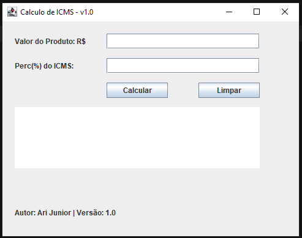
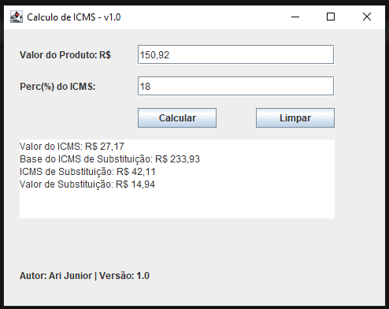

# Calculadora de ICMS e Substituição Tributária - Versão 2.0

## Descrição

Este programa em Java é uma aplicação gráfica que calcula o ICMS e a base de substituição para produtos, considerando o valor do produto e o percentual do ICMS. A interface é desenvolvida com a biblioteca Swing, permitindo que os usuários insiram os valores e obtenham os resultados de forma interativa. Agora, inclui a funcionalidade de limpar os campos.


## Funcionalidades

- **Cálculo do ICMS**: O usuário pode inserir o valor do produto e o percentual do ICMS para obter o valor do ICMS.
- **Base de Substituição**: O programa calcula automaticamente a base de substituição com base no valor do produto.
- **Resultados formatados**: Os resultados são exibidos em um formato monetário, facilitando a leitura.
- **Limpar Campos**: Função para limpar todos os campos de entrada e saída.
- **Informações de Autor e Versão**: A aplicação exibe o nome do autor e a versão na interface.

## Tecnologias Utilizadas

- **Java**: Linguagem de programação utilizada para o desenvolvimento.
- **Swing**: Biblioteca gráfica para a criação da interface do usuário.

## Visão gráfica da Tela:

- **Tela inicial**



- **Tela com valores**



## Como Usar

1. Compile o código fonte:
   ```bash
   javac -d . App.java
   ```

2. Crie o arquivo JAR:
   ```bash
   jar cfm App.jar MANIFEST.MF org/example/versao02/App.class
   ```

3. Execute o programa:
   ```bash
   java -jar App.jar
   ```

4. Insira o **valor do produto** e o **percentual do ICMS** nos campos apropriados.
5. Clique no botão **Calcular** para obter os resultados.
6. Para limpar os campos, clique no botão **Limpar**.

## Exemplo de Entrada

- Valor do Produto: R$ 100,00
- Percentual do ICMS: 18

## Exemplo de Saída

```
Valor do ICMS: R$ 18,00
Base do ICMS de Substituição: R$ 155,00
ICMS de Substituição: R$ 27,90
Valor de Substituição: R$ 9,90
```

## Requisitos

- **Java JDK 8 ou superior**: Certifique-se de ter o JDK instalado em seu sistema.
- **IDE de sua preferência**: Recomenda-se o uso de uma IDE como IntelliJ IDEA ou Eclipse para facilitar o desenvolvimento.

## Autor

Este projeto foi desenvolvido por **Ari Junior**

- **LinkedIn:** https://www.linkedin.com/in/arijunior09/
- **GitHub:** https://github.com/AriJunior09

## Versão

2.0

## Data de Lançamento

2024-10-03

---